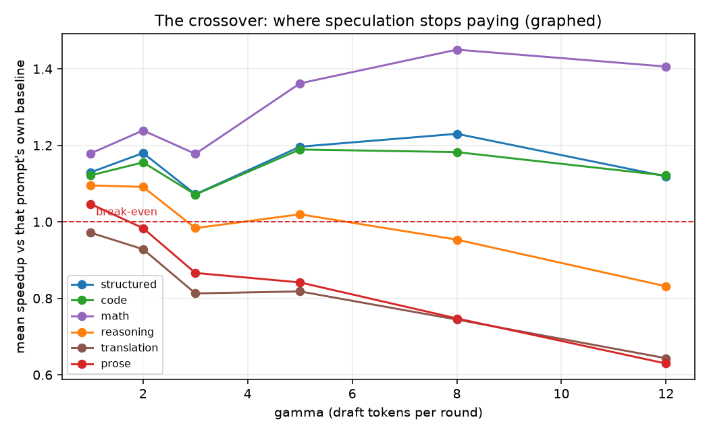
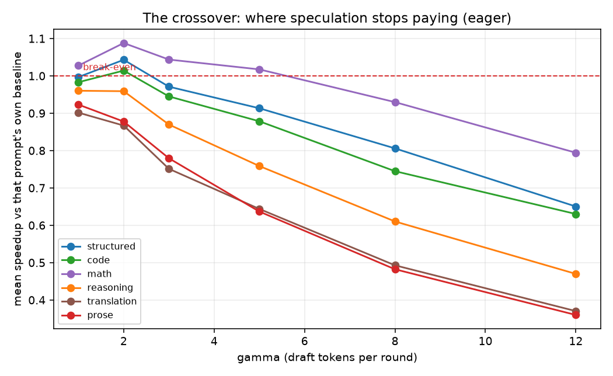
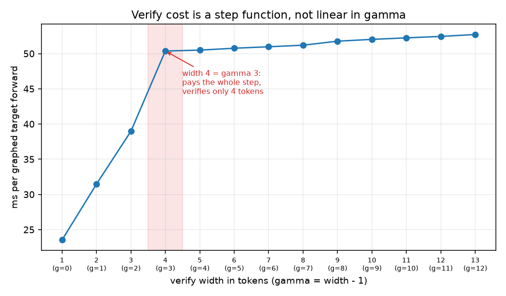
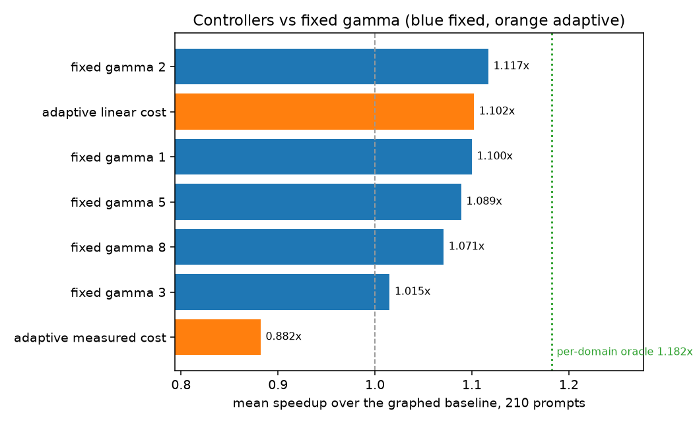
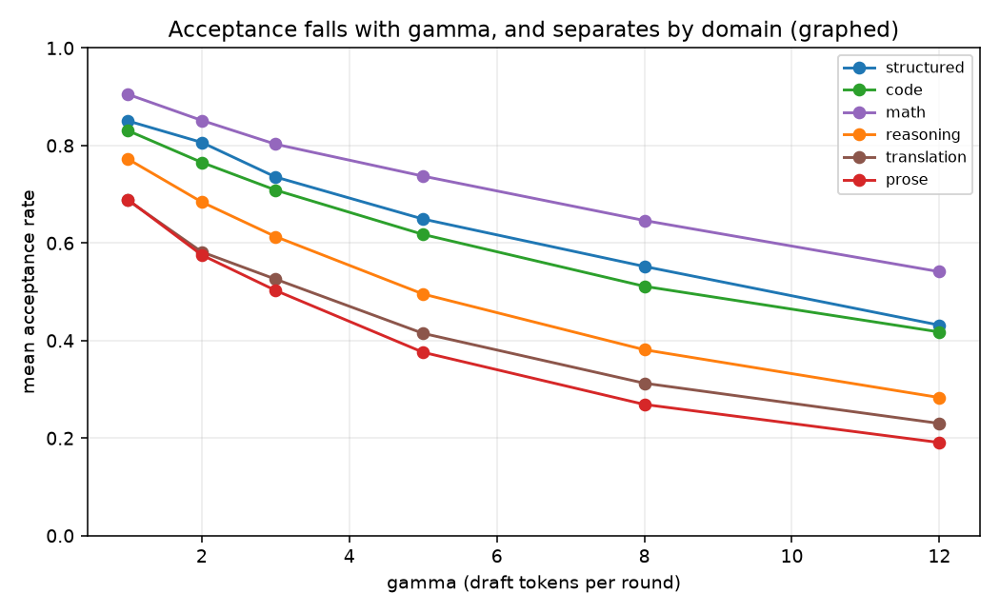
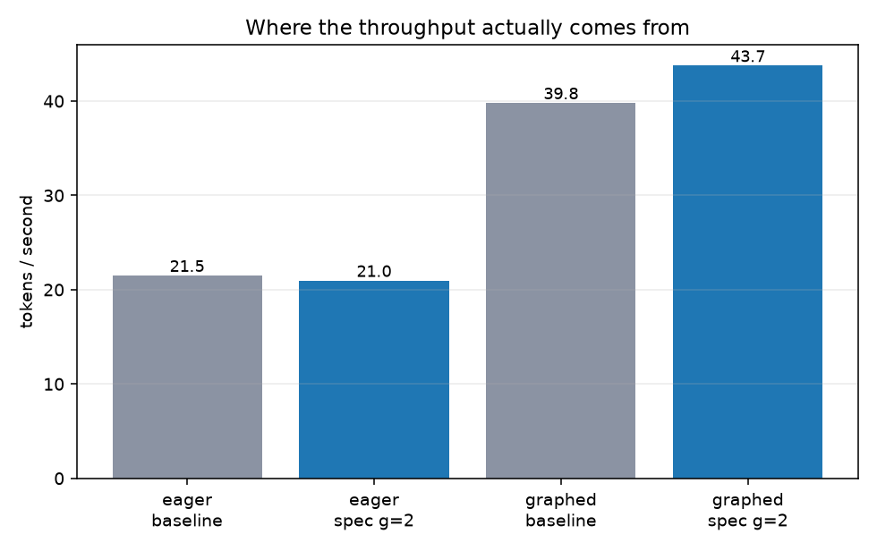

# The Crossover Point

**Speculative decoding on a consumer GPU: where it pays, where it doesn't, and why.**

A 0.5B draft model proposes tokens; a 4-bit 7B target verifies them in one
forward pass. Output matches greedy decoding from the target alone. Everything
here runs on one RTX 3060 (12 GB) under Windows.

> **What this is not.** Speculative decoding is published work
> ([Leviathan et al. 2022](https://arxiv.org/abs/2211.17192),
> [Chen et al. 2023](https://arxiv.org/abs/2302.01318)). This project did not
> invent it. The contribution is measurement and analysis on consumer hardware.

To reproduce everything from zero, follow **[REPRODUCE.md](REPRODUCE.md)**.

---

## Headline results

| | tok/s | vs eager baseline |
|---|---|---|
| Eager greedy decoding (the starting point) | **21.49** | 1.00× |
| Eager + speculation, best case (math, γ=2) | 23.4 | 1.09× |
| **CUDA graphs, no speculation** | **39.79** | **1.85×** |
| CUDA graphs + speculation, best case (math, γ=8) | 57.7 | **2.69×** |

**The biggest win on this hardware is not speculation.** It is removing kernel
launch overhead with CUDA graphs. Speculation adds a smaller gain on top, and
only in some domains.

---

## Findings

### 1. On this machine the forward pass is host-bound, not memory-bound

The textbook argument for speculation is that decoding is memory-bandwidth
bound, leaving compute idle. Measured here, that is false:

- A 0.5B draft forward costs **29.1 ms for 1 token and 31.7 ms for 256** — flat.
- Only **~5.2 ms** is GPU work; the rest is **~940 CUDA kernel launches** at
  12.9 µs each (Windows WDDM; Linux is typically 3–5 µs).
- So cost tracks **layer count**, not parameters. The 0.5B draft has 24 layers,
  the 7B has 28. The draft/target cost ratio is **r = 0.64**, where the plan
  assumed 0.06–0.20.

`results/cost_ratio.json`

### 2. CUDA graphs fix it, with no Triton

Capturing the decode step as a CUDA graph replays ~940 kernels with one launch.
Output stays token-identical.

| model | eager | graphed | factor |
|---|---|---|---|
| draft 0.5B (fp16) | 43.2 ms/tok | 5.9 ms/tok | 7.3× |
| target 7B (NF4 4-bit) | 60.6 ms/tok | 23.7 ms/tok | 2.6× |

bitsandbytes NF4 captures fine. The cost ratio drops from **r = 0.71 → 0.248**
(measured with the same protocol on both sides — graphing only the draft and
comparing against an eager target would give a misleading 0.13).

### 3. The crossover, per domain

Mean speedup over each prompt's own baseline, 210 prompts, 35 per domain.

**Graphed regime** (`results/sweep_graphed.jsonl`):

| domain | γ=1 | γ=2 | γ=3 | γ=5 | γ=8 | γ=12 | best |
|---|---|---|---|---|---|---|---|
| math | 1.179 | 1.239 | 1.178 | 1.362 | **1.450** | 1.406 | γ=8 |
| structured | 1.130 | 1.180 | 1.072 | 1.197 | **1.230** | 1.119 | γ=8 |
| code | 1.122 | 1.155 | 1.071 | **1.189** | 1.182 | 1.121 | γ=5 |
| reasoning | **1.095** | 1.091 | 0.984 | 1.020 | 0.954 | 0.831 | γ=1 |
| prose | **1.047** | 0.983 | 0.866 | 0.842 | 0.747 | 0.630 | γ=1 |
| translation | 0.971 | 0.928 | 0.813 | 0.818 | 0.744 | 0.643 | **never** |

**Eager regime** (`results/sweep.jsonl`) — with r = 0.64, the crossover arrives
almost immediately:

| domain | best γ | best speedup |
|---|---|---|
| math | 2 | 1.088 |
| structured | 2 | 1.043 |
| code | 2 | 1.014 |
| reasoning | — | never pays (best 0.960) |
| prose | — | never pays (best 0.923) |
| translation | — | never pays (best 0.902) |

Four different optimal γ values across six domains in the graphed regime.
Acceptance at γ=1: math 0.905, structured 0.852, code 0.824, reasoning 0.772,
translation 0.713, prose 0.695.

### 4. Verify cost is a step function — which explains the γ=3 dip

Every domain dips at γ=3. Timing the graphed verify forward directly
(`results/verify_width.json`):

| width | 1 | 2 | 3 | **4** | 5 | 8 | 13 |
|---|---|---|---|---|---|---|---|
| ms | 23.5 | 31.5 | 39.0 | **50.4** | 50.5 | 51.2 | 52.7 |

Cost rises steeply to width 3, **jumps at width 4, then is nearly flat**: width 13
costs 2.3 ms more than width 4. Since γ=3 means a width-4 verify, it pays the
whole step while checking only four tokens. Practical rule on this hardware:
**use γ ≤ 2 or γ ≥ 5, never 3 or 4.** It also means the standard cost model
`γ·r + 1` is wrong here.

### 5. The adaptive controller does not beat a fixed γ

This was intended as a contribution. Measured honestly, it does not hold
(`results/controller_comparison.json`, 210 prompts):

| config | mean speedup |
|---|---|
| per-domain oracle (knows the domain, hindsight) | 1.182 |
| **fixed γ=2** | **1.117** |
| adaptive controller, linear cost model | 1.102 |
| fixed γ=1 | 1.100 |
| fixed γ=5 | 1.089 |
| fixed γ=8 | 1.071 |
| fixed γ=3 | 1.015 |
| adaptive controller, measured cost model | 0.882 |

- **Fixed γ=2 already reaches 94% of the oracle.** Total headroom for *any*
  adaptive policy on this workload is 5.8%, and the controller's lag costs more
  than that.
- The linear-cost controller spends 31% of rounds at γ=3–4, the pessimal region.
- The deeper issue: the cost model assumes one acceptance rate independent of γ,
  but measured acceptance falls as γ rises (structured 0.850 at γ=1 → 0.561 at
  γ=8). The controller estimates a quantity that depends on the knob it is
  tuning. Fixing that needs per-position acceptance — a redesign.
- Found and fixed along the way: γ=0 was an **absorbing state** (a round that
  drafts nothing gives no acceptance evidence, so the controller could never
  switch speculation back on). The controller now probes periodically.

### 6. Losslessness holds wherever greedy decoding is defined

| regime | identical runs |
|---|---|
| eager | 1220 / 1260 (96.8%) |
| graphed | 1218 / 1260 (96.7%) |

All 40 eager mismatches were re-measured (`results/divergence_analysis.json`):
**every one** is a position where the target's top two logits differ by exactly
0 or exactly 1 fp16 ULP. **Zero decoder bugs.** At such a tie, the baseline's own
choice depends on floating-point reduction order, so "greedy output" is not
well defined there. The accurate claim is: *byte-identical wherever the target
has a representable preference*, not an unqualified 100%.

---

## Charts

| | |
|---|---|
|  |  |
|  |  |
|  |  |

---

## Live demo

```
cd /d E:\Crossover_point && conda activate crossover && python -m uvicorn src.server:app --port 8000
```

Open `http://127.0.0.1:8000/`. Four panels: token stream coloured by origin
(green accepted, amber corrected, grey free bonus token), controller state,
a baseline-vs-speculative race with a character-identity check, and a
client-side crossover explorer. **Replay recorded** plays
`results/mixed_trace.json` without touching the GPU.

The recorded trace mixes prose and code in one answer: 1.40× over the graphed
baseline, output identical, and the controller's γ climbs from 1–3 during the
prose sentence to 5–8 in the code block.

---

## Limitations — read before quoting numbers

- **One machine.** RTX 3060, Ryzen 5 5600, Windows WDDM. The host-bound finding
  depends on WDDM's kernel-launch cost and will be weaker on Linux.
- **Batch size 1, greedy only.** No sampling, no batching.
- **Regimes ran on slightly different prompt sets.** The eager sweep ran before
  21 prompts were fixed (9 code, 11 translation, 1 structured). Math, reasoning
  and prose are directly comparable across regimes; code and translation are not.
- **Eval set provenance.** 210 prompts: 12 written by hand; 198 drafted with
  `qwen2.5-coder:32b` via Ollama, of which 21 were substantively rewritten by
  hand. The `source` field labels all 198 as `hand-edited`.
- **Graphed-regime mismatches are not individually classified.** The divergence
  analyser reproduces mismatches on the eager path only. The graphed mismatch
  rate (96.7%) matches eager (96.8%), consistent with the same fp16-tie cause,
  but that is inferred, not measured per case.
- **Timing hygiene matters.** A first graphed sweep was invalidated by a game
  running on the same GPU; its data is kept separately as
  `results/sweep_graphed_contaminated.jsonl` and is not used anywhere above.

---

## Layout

```
src/compat.py        the only code touching transformers cache/loading APIs
src/models.py        model pair loading, chat template
src/baseline.py      greedy decoding, eager and CUDA-graphed
src/specdec.py       speculative decoding, eager and CUDA-graphed
src/adaptive.py      gamma controller
src/server.py        FastAPI + SSE
web/index.html       single-file UI
tests/               pytest gates
scripts/             experiments, analysis, charts
data/eval.jsonl      210 prompts, 6 domains
results/             every measurement
charts/              every figure
```

Models: `Qwen/Qwen2.5-Coder-7B-Instruct` (target, NF4 4-bit) and
`Qwen/Qwen2.5-Coder-0.5B-Instruct` (draft, fp16). They share a tokenizer —
151,665 tokens, zero differences.
